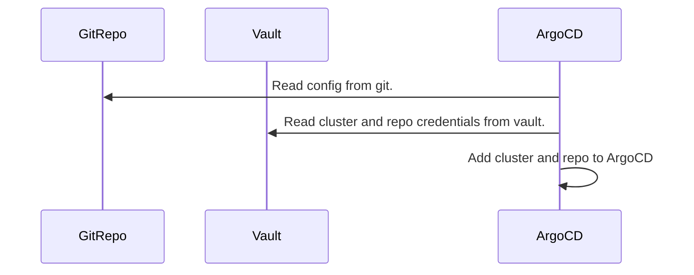

# ArgoCD clusters and repo management using hashicorp vault.

## Getting started

This README file will help you manage the ArgoCD resources in a GitOps way.

## How this works.

This repo contains the list of k8s clusters and git repo which needs to be added to ArgoCD.

1. ArgoCD will read the k8s cluster and repo credentials from the vault and configure them accordingly.
2. ArgoCD uses special labels for clusters and repositories, which will be added as part of the template.

```
labels:
    argocd.argoproj.io/secret-type: cluster
```

```
labels:
    argocd.argoproj.io/secret-type: repository
```    




## Prerequisites

1. hashicorp vault setup.
2. The vault path with repo and cluster credentials has to be configured prior to this exercise.

## Examples

`cat values.yaml`

```
repositories:
  - "infrastructure-helm-charts"
  - "business-helm-charts"
  - "argocd-infra-apps"
  - "argocd-business-apps"

clusters:
  - "dev-cluster"
  - "stage-cluster"
  - "uat-cluster"
  - "prod-cluster"
```

## Explanation

`repositories`: A list of repositories needs to be added to ArgoCD.

`clusters`: A list of Kubernetes clusters needs to be added to ArgoCD.

We are using the helm template for creating these. 

**Repository**
Where `repo` will be a list of `repositories`
```
url: vault:secrets/data/argocd/repositories/{{ $repo }}#url
password: vault:secrets/data/argocd/repositories/{{ $repo }}#password
  ```

So if you have this, 
```
repositories:
  - "infrastructure-helm-charts"
  - "business-helm-charts"
```
Equivalent to vault path
```
url: vault:secrets/data/argocd/repositories/infrastructure-helm-charts#url
password: vault:secrets/data/argocd/repositories/infrastructure-helm-charts#password


url: vault:secrets/data/argocd/repositories/business-helm-charts#url
password: vault:secrets/data/argocd/repositories/business-helm-charts#password
```

**Clusters**
Where `cluster` will be a list of `clusters`
```
name: {{ $cluster }}
server: vault:secrets/data/argocd/clusters/{{ $cluster }}#endpoint
config: vault:secrets/data/argocd/clusters/{{ $cluster }}#config
  ```

So if you have this, 
```
clusters:
  - "dev-cluster"
  - "stage-cluster"
```
Equivalent to vault path
```
name: dev-cluster
server: vault:secrets/data/argocd/clusters/dev-cluster#endpoint
config: vault:secrets/data/argocd/clusters/dev-cluster#config

name: stage-cluster
server: vault:secrets/data/argocd/clusters/stage-cluster#endpoint
config: vault:secrets/data/argocd/clusters/stage-cluster#config
```
