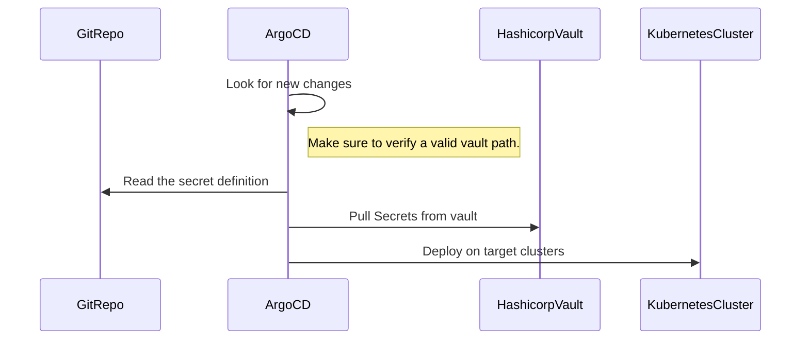

# kubernetes-secrets

## Getting started

The repo will contain the list of secrets to be created in Kubernetes clusters.

## How this works.

Using GitOps principles, we're going to create secrets on k8s clusters.



## Prerequisites

1. hashicorp vault setup.
2. The vault path with credentials has to be configured prior to this exercise.

## Examples

```
access: "dev-kubernetes"
url: "https://vault.default:8200"
secrets:
  - name: pgouser-admin
    namespaces:
      - database
    data:
      username: vault:secrets/data/dev/k8s-secrets/pgouser-admin#username
      password: vault:secrets/data/dev/k8s-secrets/pgouser-admin#password
      roles: vault:secrets/data/dev/k8s-secrets/pgouser-admin#roles
```

## Explanation

`access`: This is the name of the access which will be required here, `vault.security.banzaicloud.io/vault-path`

`vault-role`: Role which you configured on vault.

`url`: vault URL.

`secrets.name`: Secret name to be created.

`secrets.namespaces` namespace where secrets will be created, this supports multiple namespaces.

Example of multiple namespaces.
```
secrets:
  - name: my-secret
    namespaces:
      - database
      - financial-app
    data:
      username: vault:secrets/data/dev/k8s-secrets/sample#username
```

`data`: data to be used in secrets, provide the vault path.


## NOTE

1. If you provide the wrong vault path, the secret won't be able to read from the vault.

2. Make sure the accessor which you are using has the access to the vault path.
